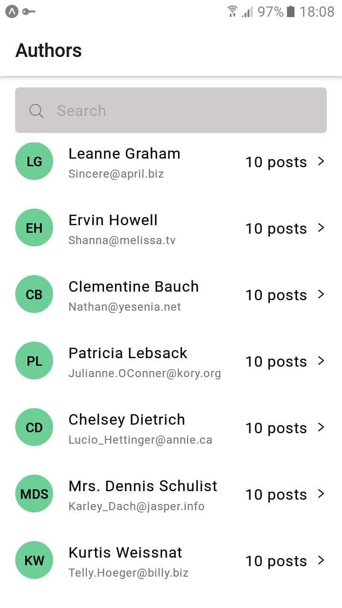
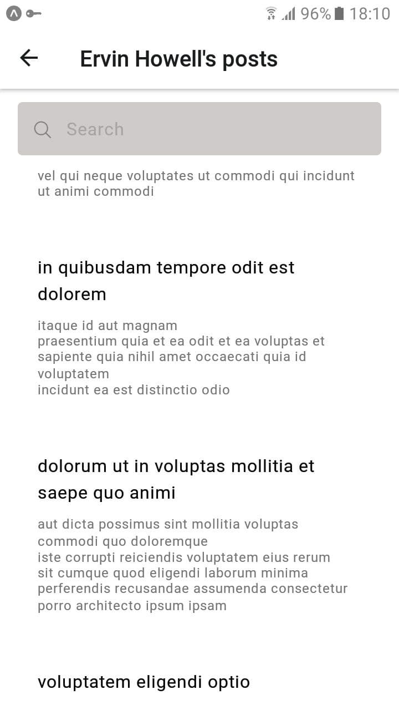
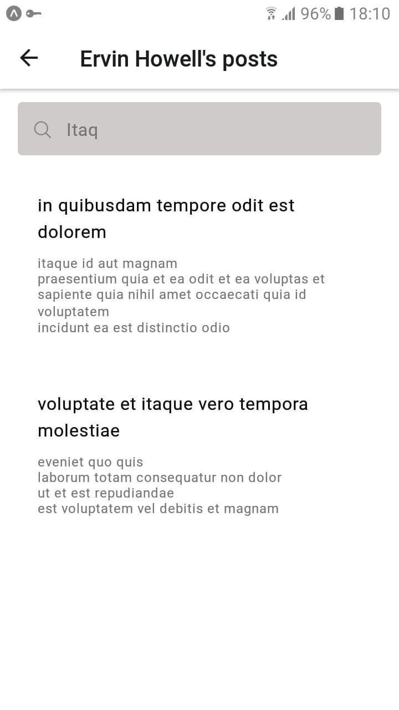

# React-native Test-task

The application contains 2 screens: Authors screen. It shows a list of authors. User can search by name and email. Posts screen. It Shows posts by selected Author. User can search by title and post content.

# Authors Screen

# Authors Screen (searching by name and email)

# Posts Screen

# Posts Screen (searching by title and post content)

